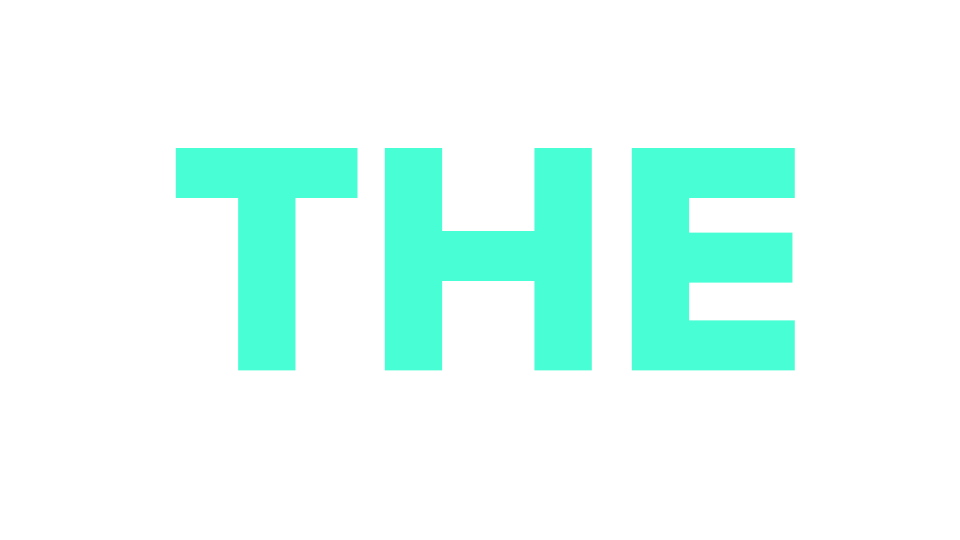

<!-- Improved compatibility of back to top link: See: https://github.com/othneildrew/Best-README-Template/pull/73 -->
<a name="readme-top"></a>
<!--
*** Thanks for checking out the Best-README-Template. If you have a suggestion
*** that would make this better, please fork the repo and create a pull request
*** or simply open an issue with the tag "enhancement".
*** Don't forget to give the project a star!
*** Thanks again! Now go create something AMAZING! :D
-->


<!-- PROJECT SHIELDS -->
<!--
*** I'm using markdown "reference style" links for readability.
*** Reference links are enclosed in brackets [ ] instead of parentheses ( ).
*** See the bottom of this document for the declaration of the reference variables
*** for contributors-url, forks-url, etc. This is an optional, concise syntax you may use.
*** https://www.markdownguide.org/basic-syntax/#reference-style-links
-->


<!-- PROJECT LOGO -->
<br />
<div align="center">
  <a>
    
  </a>

<h3 align="center">THE Linux Task Manager</h3>

  <p align="center">
   A user-friendly Linux process manager with a sleek UI, providing essential functionalities like process monitoring, sorting, killing, and process tree visualization. It offers a unique experience for both beginners and experienced users, combining simplicity and functionality in one tool. Powered by Rust and TUI libraries, THE delivers efficient system monitoring and control.
    <br />
    <a href=""><strong>Explore the docs »</strong></a>
    <br />
    <br />
<!--     <a href="https://docs.google.com/document/d/18K7eTcpfHaQp7JcKcI5FmpmiFu3SScy7qODZuFaczyg/edit?usp=sharing">Technical Report</a> -->
  </p>
</div>


<!-- TABLE OF CONTENTS -->
<details>
  <summary>Table of Contents</summary>
  <ol>
    <li>
      <a href="#about-the-project">About The Project</a>
      <ul>
        <li><a href="#built-with">Built With</a></li>
      </ul>
    </li>
    <li>
      <a href="#getting-started">Getting Started</a>
      <ul>
        <li><a href="#prerequisites">Prerequisites</a></li>
        <li><a href="#installation">Installation</a></li>
      </ul>
    </li>
    <li><a href="#usage">Usage</a></li>
    <li><a href="#roadmap">Roadmap</a></li>
    <li><a href="#contributing">Contributing</a></li>
    <li><a href="#license">License</a></li>
    <li><a href="#contact">Contact</a></li>
    <li><a href="#acknowledgments">Acknowledgments</a></li>
  </ol>
</details>


<!-- ABOUT THE PROJECT -->
## About The Project
This is the main view of our program where it is shown the table of processes and the CPU and memory graphs along with some info about the system and help info. 
<br/>
<br/>


In another view, user can see the table or the graphs alone. 

| Table  view                            | Graphs view                            |
| ----------------------------------- | ----------------------------------- |
|  |  |

But, if the user selected a process from the table and pressed Enter, info about this process will be shown as in the pic:


<p align="right">(<a href="#readme-top">back to top</a>)</p>


### Built With

* 


<p align="right">(<a href="#readme-top">back to top</a>)</p>


<!-- GETTING STARTED -->
## Getting Started

To get a local copy up and running follow these simple example steps.

### Prerequisites

You need to use cargo to install THE.
* Cargo 
  ```sh
  sudo apt-get update -g
  sudo apt-get -y install cargo
  ```

### Installation

1. Make sure you are using Linux OS. 
2. Clone the repo
   ```sh
   git clone https://github.com/MokhtarBaWahal/THE.git
   ```
3. Install cargo packages if not installed

4. Cd to the repo dir and run the follwing
   ```js
   cargo build
   ./target/debug/hello_cargo
   ```

<p align="right">(<a href="#readme-top">back to top</a>)</p>


<!-- USAGE EXAMPLES -->
## Usage

* q key quits/exits 
* d key to view the table and graphs 
* t key to view the table only 
* g key to view graphs only 
* Enter key to view more information about the selected process 
* Ctrl + k key to kill the selected process 
* Ctrl +  key followed by a character for quick search
* For filtering followed by character:  p(pid), u (user), r(priority), n(niceness), e: memory, h:(shared memory), b(state), c(cpu), m (memory), or t (time in sec).
* ./app pstree to print tree
* ./app u (username) to get selected user processes only 


<p align="right">(<a href="#readme-top">back to top</a>)</p>


<!-- ROADMAP -->
## Future plans

- [ ] Open client-server architecture
- [ ]  Remote monitoring


<p align="right">(<a href="#readme-top">back to top</a>)</p>


<!-- CONTRIBUTING -->
## Contributing

This project was built by the following collaborators as a term project for the course of Operating Systems at the American University in Cairo, team memebers   are:

1. Mohamed A. Soliman
2. Mokhtar S.  Ba Wahal
3. Passant A. Moustafa


<p align="right">(<a href="#readme-top">back to top</a>)</p>


<!-- LICENSE -->
## License

Distributed under the MIT License. See `LICENSE.txt` for more information.

<p align="right">(<a href="#readme-top">back to top</a>)</p>


<!-- CONTACT -->
## Contact

Mokhtar Salem Ba Wahal - [@mbawhil](https://twitter.com/mbawhil) - mokhtarsalem@aucegypt.edu

Project Link: [https://github.com/MokhtarBaWahal/THE](https://github.com/MokhtarBaWahal/THE)

<p align="right">(<a href="#readme-top">back to top</a>)</p>


<!-- ACKNOWLEDGMENTS -->
## Acknowledgments

* The development team would like to thank the  people who contributed to the development of sysinfo and tui crates, especially the examples provided with tui crate. Also, we would like to thank our professor Amr El-kadi for his continuous feedback during the semester. 

<p align="right">(<a href="#readme-top">back to top</a>)</p>


<!-- MARKDOWN LINKS & IMAGES -->
<!-- https://www.markdownguide.org/basic-syntax/#reference-style-links -->
[contributors-shield]: https://img.shields.io/github/contributors/MokhtarBaWahal/THE.svg?style=for-the-badge
[contributors-url]: https://github.com/MokhtarBaWahal/THE/graphs/contributors
[forks-shield]: https://img.shields.io/github/forks/MokhtarBaWahal/THE.svg?style=for-the-badge
[forks-url]: https://github.com/MokhtarBaWahal/THE/network/members
[stars-shield]: https://img.shields.io/github/stars/MokhtarBaWahal/THE.svg?style=for-the-badge
[stars-url]: https://github.com/MokhtarBaWahal/THE/stargazers
[issues-shield]: https://img.shields.io/github/issues/MokhtarBaWahal/THE.svg?style=for-the-badge
[issues-url]: https://github.com/MokhtarBaWahal/THE/issues
[license-shield]: https://img.shields.io/github/license/MokhtarBaWahal/THE.svg?style=for-the-badge
[license-url]: https://github.com/MokhtarBaWahal/THE/blob/master/LICENSE.txt
[linkedin-shield]: https://img.shields.io/badge/-LinkedIn-black.svg?style=for-the-badge&logo=linkedin&colorB=555
[linkedin-url]: https://linkedin.com/in/mokhtar-ba-wahal-3b55281a1
[product-screenshot]: images/screenshot.png
[Next.js]: https://img.shields.io/badge/next.js-000000?style=for-the-badge&logo=nextdotjs&logoColor=white
[Next-url]: https://nextjs.org/
[React.js]: https://img.shields.io/badge/React-20232A?style=for-the-badge&logo=react&logoColor=61DAFB
[React-url]: https://reactjs.org/
[Vue.js]: https://img.shields.io/badge/Vue.js-35495E?style=for-the-badge&logo=vuedotjs&logoColor=4FC08D
[Vue-url]: https://vuejs.org/
[Angular.io]: https://img.shields.io/badge/Angular-DD0031?style=for-the-badge&logo=angular&logoColor=white
[Angular-url]: https://angular.io/
[Svelte.dev]: https://img.shields.io/badge/Svelte-4A4A55?style=for-the-badge&logo=svelte&logoColor=FF3E00
[Svelte-url]: https://svelte.dev/
[Laravel.com]: https://img.shields.io/badge/Laravel-FF2D20?style=for-the-badge&logo=laravel&logoColor=white
[Laravel-url]: https://laravel.com
[Bootstrap.com]: https://img.shields.io/badge/Bootstrap-563D7C?style=for-the-badge&logo=bootstrap&logoColor=white
[Bootstrap-url]: https://getbootstrap.com
[JQuery.com]: https://img.shields.io/badge/jQuery-0769AD?style=for-the-badge&logo=jquery&logoColor=white
[JQuery-url]: https://jquery.com 
